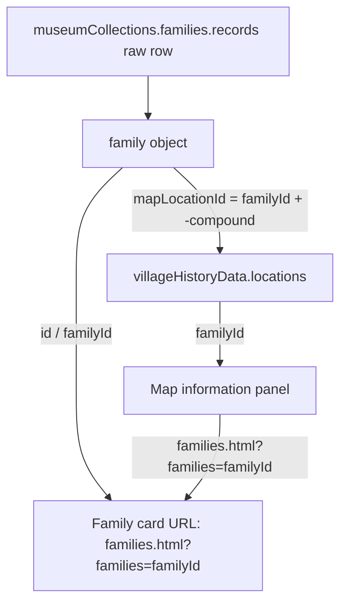
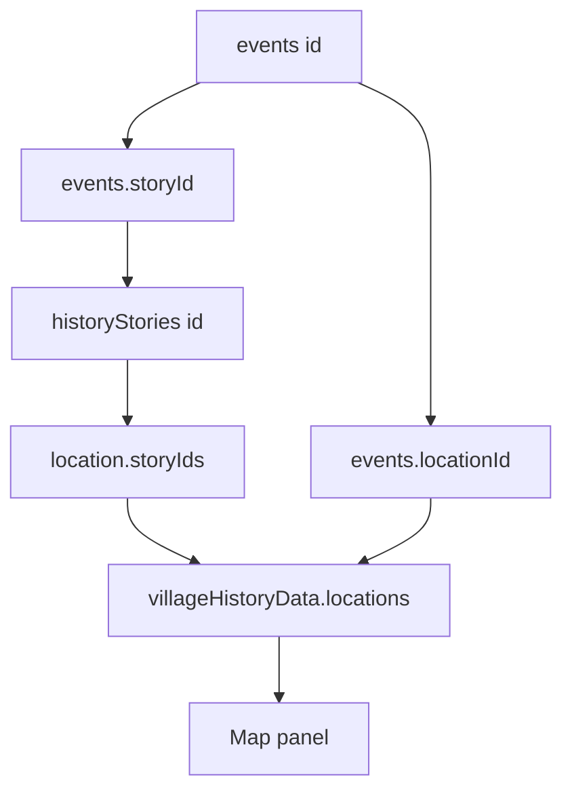

# New Demba Kunda Village Digital Museum

## Purpose of this guide

This is a maintenance map for the existing website. It separates **content/data**, **UI/logic**, **styling**, and **images/media** so that historical records can be maintained without accidentally changing the presentation.

- A family name or historical description is a **data** change.
- A photograph is an **image/media** change.
- A card, modal, search, filter, or map behaviour is a **UI/logic** change.
- Colours, spacing, fonts, and responsive layout are **styling** changes.

The principal digital-museum content is source-bound to *The History of New Demba Kunda*. Do not alter a historical fact merely because it appears unusual or inconsistent. Record questions under **Potential Data Issues to Review** and verify them against the book.

## Project Structure

There is no JSON, package manifest, build configuration, or server configuration in this project. It is a static HTML/CSS/JavaScript site. The `data/` directory exists but contains no files. All structured content is currently stored directly in JavaScript.

| Area | Actual files/folders | Purpose |
|---|---|---|
| Main pages | `index.html`, `about.html`, `contact.html`, `event.html`, `team.html`, `testimonial.html`, `Archive.html`, `timeline.html` | Older/static template site pages; most content is hard-coded in the HTML. |
| Digital Museum | `museum.html`, `js/history-data.js`, `js/history-archive.js`, `css/history-archive.css` | Searchable and filterable archive of 20 history stories. |
| Families | `families.html`, `js/collections-data.js`, `js/collections.js`, `css/collections.css` | Active family-compound collection: cards and modal/detail sheet. |
| Farming Places | `farming.html`, `js/collections-data.js`, `js/collections.js`, `css/collections.css` | Active farming/forest collection: cards and modal/detail sheet. |
| Wells | `wells.html`, `js/collections-data.js`, `js/collections.js`, `css/collections.css` | Active wells collection: cards and modal/detail sheet. |
| Village Map | `village-map.html`, `js/village-map-data.js`, `js/village-map.js`, `css/village-map.css`, `css/village-map-leaflet.css` | Active interactive map, map directory, filters, map panel, and connected timeline. |
| Images | `img/` | The only local media folder. It contains seven image files. |
| Global styles | `css/bootstrap.min.css`, `css/style.css` | Bootstrap framework and shared site styling. |
| Libraries | `lib/animate/`, `lib/easing/`, `lib/owlcarousel/`, `lib/waypoints/`, `lib/wow/` | Vendor libraries used by the older template pages. |
| SCSS source | `scss/` | Bootstrap SCSS source tree. It is not the active custom styling source for the museum/map pages. |

## Important File Guide

### Active Content/Data Files

**`js/collections-data.js`**

- **Purpose:** Main structured data for the active Families, Farming Places, and Wells pages.
- **Important content:** `museumCollections` has `families`, `farming`, and `wells` collections.
- The families collection begins as compact arrays in `museumCollections.families.records`, then is converted into family objects using `.map(...)` at the bottom of the file.
- The resulting family fields are `id`, `familyId`, `name`, `compoundNumber`, `neighborhood`, `description`, `shortDescription`, `heroImage`, `heroAlt`, `source`, `relatedPeople`, `relatedPlaces`, and `mapLocationId`.

**`js/history-data.js`**

- **Purpose:** Main structured data for the active Digital Museum.
- **Important content:** `HISTORY_BOOK_URL` and the `historyStories` array of 20 historical records.
- A story uses: `id`, `category`, `period`, `title`, `teaser`, `description`, `importance`, `people`, `places`, optional `timelineYear`, and `source`.
- No current story has an image, video, audio, document, or per-story book-link field.

**`js/village-map-data.js`**

- **Purpose:** Main data source for the active Village Map.
- **Important content:** `villageHistoryData.map`, `villageHistoryData.locations`, `villageHistoryData.events`, `villageHistoryData.features`, and `villageHistoryData.legend`.
- Location fields used by the active map include `id`, `name`, `category`, `markerIcon`, `mapPosition`, `positionType`, `coordinates`, `description`, `historicalSignificance`, `people`, `bookReference`, `storyIds`, optional `familyId`, `neighborhood`, `compoundNumber`, and `relatedLocationIds`.
- `mapPosition` values are illustrative percentage-like positions. All current `coordinates` are `null`; they are not verified geographic coordinates.
- The file first assigns a placeholder version of `villageHistoryData`, then overwrites it with the effective content and appends further locations in immediately invoked functions. Maintain the effective, later data rather than the overwritten placeholder object.

### Active UI/Logic Files

**`js/collections.js`**

- **Purpose:** Builds cards and the full-screen detail/modal sheet for the active Families, Farming Places, and Wells pages.
- **Important content:** Reads `document.body.dataset.collection`, uses `museumCollections[key]`, and renders `[data-collection-grid]` and `[data-collection-detail]`.
- The `showDetail(record)` function controls the detail window/modal.
- The family-card action button is generated here as **Explore family**. Its map link is generated from `record.mapLocationId` as `village-map.html?location=<mapLocationId>`.

**`js/collections-home.js`**

- **Purpose:** Generates selected collection cards on the home page.
- **Important content:** `renderCollection()` renders families, farming places, and wells into `#families`, `#farming-places`, and `#wells` respectively when those sections exist.

**`js/history-archive.js`**

- **Purpose:** Builds the Digital Museum cards, search, category filters, and in-page story detail panel.
- **Important content:** `filteredStories()`, `renderStories()`, and `renderDetail(story)` operate on `historyStories`.

**`js/village-map.js`**

- **Purpose:** Active map behaviour for `village-map.html`.
- **Important content:** Leaflet markers when available, schematic fallback, category layers, checkbox filters, search, zoom, pan, location directory, map information panel, and event timeline.
- `filterGroups` defines which data categories appear under each filter.
- `renderPanel(location)` controls the content shown after a marker/location is selected.
- `locationById()`, `eventsFor()`, and `storyById()` connect location IDs, events, and museum story IDs.

### Active Styling Files

**`css/style.css`**

- **Purpose:** Shared site styling, navigation, footer, general layout, home-page sections, and the older homepage timeline/modal styling.

**`css/collections.css`**

- **Purpose:** Family/farming/well collection hero, cards, images, modal/detail sheet, and responsive layouts.
- **Use this file to change:** Active family-card layout and the active collection detail/modal appearance.

**`css/history-archive.css`**

- **Purpose:** Digital Museum hero, search/filter controls, story cards, and story detail panel.

**`css/village-map.css`**

- **Purpose:** Active map frame, markers, schematic fallback, map panel, directory, controls, and responsive map layout.

**`css/village-map-leaflet.css`**

- **Purpose:** Extra Leaflet/catalog-map styling. Some rules support older map experiments as well as classes used by map interfaces.

**`css/bootstrap.min.css`**

- **Purpose:** Vendor Bootstrap CSS. Avoid editing it for normal custom styling; use `css/style.css` or the page-specific custom CSS files.

### Legacy/Standalone Data and Detail Files

These files contain separate, older template data and are not the data source for the active `families.html`, `farming.html`, or `wells.html` collection pages:

| File | Purpose | Current relationship |
|---|---|---|
| `family.html`, `js/family-data.js`, `js/family-detail.js` | Legacy individual family detail page using `familyPlaces` and query parameter `family`. | Separate from the active collection system. |
| `forest.html`, `js/forest-data.js`, `js/forest-detail.js` | Legacy forest detail page using `forestPlaces`. | Separate from active `farming.html`. |
| `well.html`, `js/well-data.js`, `js/well-detail.js` | Legacy well detail page using `wellPlaces`. | Separate from active `wells.html`. |
| `heritage.html`, `js/heritage-data.js`, `js/heritage-detail.js` | Legacy heritage place details using `heritagePlaces` and query parameter `place`. | Used by links in the older home-page heritage cards. |
| `js/village-map-book.js` | Alternative hard-coded illustrative map. | Not loaded by `village-map.html`. |
| `js/village-map-leaflet.js` | Alternative hard-coded location catalog map. | Not loaded by `village-map.html`. |

## Family Management

### Where Family Information Is Stored

The active source of truth is **`js/collections-data.js`**, in `museumCollections.families.records`.

| Need | Actual field/location |
|---|---|
| Family name | Raw record index `1`; resulting field `name` |
| Family description | Raw record index `3`; resulting field `description` |
| Brief card summary | Raw record index `4`; resulting field `shortDescription` |
| Compound number | Raw record index `2`; resulting field `compoundNumber` |
| Family ID | Raw record index `0`; resulting fields `id` and `familyId` |
| Map location ID | Resulting `mapLocationId`, generated as `record[0] + '-compound'` |
| Neighbourhood | `neighbourhoods` lookup in the conversion `.map(...)`; non-listed families receive `Neighbourhood awaiting verification` |
| Family photograph | Resulting `heroImage` field; all active families currently use `img/hero.jpg` |
| Family cards | `js/collections.js` (`grid.innerHTML`) and `css/collections.css` |
| Family detail window/modal | `js/collections.js`, `showDetail(record)`, and `css/collections.css` |
| Family-to-map connection | `familyId` / `mapLocationId` in `js/collections-data.js`, then dynamic family map records in `js/village-map-data.js` |
| Map-to-family connection | Map location `familyId`, then `js/village-map.js` generates the family link |
| “View family” functionality | The active map uses `families.html?families=<familyId>`; `js/collections.js` opens that record from the URL |

### Real Example: JAGANARA KHORE

- **Family:** `JAGANARA KHORE`
- **File:** `js/collections-data.js`
- **Object/array:** `museumCollections.families.records`
- **Raw record:** `['jaganara-khore', 'JAGANARA KHORE', 'Compound No. 1', "The founder's family: Foday Jagana, son of Sambou Jagana.", 'Founder family']`
- **Name field:** raw index `1`, exposed to the pages as `name`
- **Compound field:** raw index `2`, exposed as `compoundNumber`
- **Description field:** raw index `3`, exposed as `description`
- **Family ID:** raw index `0`, `jaganara-khore`, exposed as `id` and `familyId`
- **Map location ID:** generated `mapLocationId`, `jaganara-khore-compound`
- **Current image:** generated `heroImage`, `img/hero.jpg`

### How to Edit a Family

**A. Change a family name**

1. In `js/collections-data.js`, find the family row in `museumCollections.families.records` using its ID, for example `jaganara-khore`.
2. Change the second value, raw index `1`.
3. The rendered `name` and active family cards/modal update automatically. Do not change the ID unless every map and URL connection is updated too.

**B. Change a compound number**

1. In the same raw family record, edit raw index `2`.
2. The resulting field is `compoundNumber`.

**C. Change a family description**

1. In the same raw family record, edit raw index `3`.
2. The resulting field is `description` and is shown in the detail sheet.
3. Edit raw index `4` separately for the short card summary (`shortDescription`).

**D. Replace a family image**

1. Put the approved local photograph in `img/`.
2. In the conversion code at the bottom of `js/collections-data.js`, replace the shared `heroImage: 'img/hero.jpg'` behaviour with an image path selected per family record, or add a per-record image value and map it to `heroImage`.
3. The active system already reads `record.heroImage`; no change to the card/modal logic is necessary once each object receives the correct path.

**E. Add a new family**

1. Add a new row to `museumCollections.families.records` with five values in this order: unique ID, displayed name, compound number, full description, short description.
2. Add the ID to the `neighbourhoods` object in the conversion code if its neighbourhood is known.
3. Ensure its generated `mapLocationId` is unique. The map automatically creates a matching Family Compound from every family object.
4. Add a per-family photograph field if you have changed the shared image system to support it.

**F. Remove a family**

1. Remove its row from `museumCollections.families.records`.
2. Its generated family card and dynamically generated map compound disappear.
3. Check links in `js/village-map-data.js` and old HTML pages for hard-coded references to that ID before removal.

## Family Image System

- **Image folder:** `img/`
- **Active family image field:** `heroImage` in the final family object created in `js/collections-data.js`.
- **Current path:** Every active family uses the local path `img/hero.jpg`.
- **Placeholder:** `heroAlt` explicitly calls it a “temporary family image placeholder.” The UI also displays “Historical image coming soon” if an image fails to load.
- **Reuse:** All 34 active family records share `img/hero.jpg`, so it is a temporary shared image rather than individual family photography.
- **Local files, not URLs:** Active family photographs use local relative paths. No external image URL is used by the active family collection.

To replace the temporary photograph for JAGANARA KHORE later, store the approved photograph in `img/`, then make the JAGANARA KHORE record resolve to that image through its `heroImage` field. Keep its `familyId` and `mapLocationId` unchanged.

## Village Map

### Active Map Files

| Need | File / structure |
|---|---|
| Map HTML | `village-map.html` |
| Map data | `js/village-map-data.js`, `villageHistoryData` |
| Map logic | `js/village-map.js` |
| Main map CSS | `css/village-map.css` |
| Supplemental Leaflet/catalog CSS | `css/village-map-leaflet.css` |
| Map library | Leaflet loaded from CDN in `village-map.html` |
| Markers | `villageHistoryData.locations` |
| Categories | Each location `category`; UI grouping in `filterGroups` in `js/village-map.js` |
| Search | `[data-map-search]` in HTML; `matchesSearch()` in `js/village-map.js` |
| Filters | `[data-map-filters]`; `mapFilterMarkup()` and `filterGroups` |
| Zoom/pan/reset | `initialiseSchematicMapControls()` and Leaflet controls in `js/village-map.js` |
| Information panel | `[data-history-panel]`; rendered by `renderPanel(location)` |
| Location IDs | Every map item uses `id` |
| Illustrative position | `mapPosition`; map features use `points` or `bounds` |
| Geographic coordinate | `coordinates`; all current locations have `null` |
| Family connection | family object `mapLocationId`; dynamic map record `familyId` |
| Map-to-family link | Map record `familyId`; a link to `families.html?families=<familyId>` |
| Map images | None of the effective map location records has a populated image/media path. The map renders media placeholders when no `media` item is available. |

### Map Editing Tasks

**Change a location name:** Edit the location object’s `name` in `js/village-map-data.js`.

**Change a location description:** Edit `description`; edit `historicalSignificance` separately when needed.

**Change a map image:** The active locations do not currently use an image field. Add approved local media to the location’s `media.historicalImages` or `media.currentImages` array only after confirming the data shape used by `mediaMarkup()` in `js/village-map.js`.

**Add a map location:** Add an object to `villageHistoryData.locations` with at least a unique `id`, `name`, `category`, `markerIcon`, `mapPosition`, `positionType: 'illustrative'`, `coordinates`, `description`, `historicalSignificance`, `people`, `bookReference`, and `storyIds`. Add `familyId` for a family compound.

**Remove a map location:** Remove its location object. First check `events.locationId`, `relatedLocationIds`, family `mapLocationId`, and `storyIds` for references.

**Change a map category:** Change the location’s `category`. Update `filterGroups` in `js/village-map.js` if it should appear under a particular filter; add a matching legend item if needed.

**Change an illustrative position:** Edit `mapPosition: [vertical, horizontal]`. These positions are illustrative and not survey coordinates. Lines use `points`; regions use `bounds`.

**Change click-panel information:** For content, change the selected location’s fields in `js/village-map-data.js`. For labels/structure/behaviour, edit `renderPanel(location)` in `js/village-map.js`. For visual layout, edit `css/village-map.css`.

## Complete Map Location Inventory

All entries below are effective records assembled into `villageHistoryData.locations` in `js/village-map-data.js`. Unless marked otherwise, every row has `coordinates: null`, `positionType: 'illustrative'`, no image field/path, and uses `mapPosition` as its position field. “Family ID” is only present where the map record has one.

| Implemented category | Location names and IDs |
|---|---|
| Community history | `Village Centre` (`village-centre`) |
| Religion and scholarship | `Central Mosque` (`central-mosque`) |
| Education | `Arabic Schools` (`arabic-schools`); `English School` (`english-school`) |
| Land and water | `Historic Wells` (`historic-wells`) |
| Community life | `Farms and Gardens` (`farms-gardens`) |
| Lost history | `Lost Villages` (`lost-villages`) |
| Neighbourhoods requested, but currently categorised as `Nearest City` | `DENGHENA / DENGHENAN KOTI` (`denghena-denghenan-koti`); `BANTAN KAANU` (`bantan-kaanu`); `CHARAPPU` (`charappu`) |
| Current neighbouring villages | `Old Demba Kunda` (`old-demba-kunda`); `Demba Kunda Nyale` (`demba-kunda-nyale`); `Malinkon Kaara` (`malinkon-kaara`); `Numuyel` (`numuyel`); `Gambisara` (`gambisara`); `Sabi` (`sabi`) |
| Nearest city | `Basse` (`basse`) |
| Wells | `KHUBAN GHEDE` (`khuban-ghede`); `DARBON GHEDE` (`darbon-ghede`); `KABAN GHEDE` (`kaban-ghede`); `BANTAN GHEDE` (`bantan-ghede`); `MAYISIN GHEDE` (`mayisin-ghede`); `JUMAN GHEDE` (`juman-ghede`); `GARANKAN GHEDE` (`garankan-ghede`) |
| Public Spaces / Bantaba | `MISIDIN KURA` (`misidin-kura`); `SEYINKAN KURA` (`seyinkan-kura`); `MAMADIN KURA` (`mamadin-kura`); `KABAN KURA` (`kaban-kura`); `BANTAN KURA` (`bantan-kura`); `CHARAPPUN KURA` (`charappun-kura`) |
| Ponds / Water Features | `Dala Gilleh` (`dala-gilleh`); `Hurunkun Dala` (`hurunkun-dala`); `Dala Lemmeh` (`dala-lemmeh`); `Jamban Dala` (`jamban-dala`); `Simakhan Dala` (`simakhan-dala`); `Kumma Kejugun Dala` (`kumma-kejugun-dala`); `Dala Khore` (`dala-khore`); `Sikhou Hounen Dala` (`sikhou-hounen-dala`); `Khilin Dala` (`khilin-dala`); `Saban Dala` (`saban-dala`); `Khumba Janken Dala` (`khumba-janken-dala`) |
| Farming Places / Farmlands | `Haaja` (`farmland-0`); `Bilalin Saro` (`farmland-1`); `Bassen Kille` (`farmland-2`); `Giden Kamma` (`farmland-3`); `Saro` (`farmland-4`); `Jalihara` (`farmland-5`); `Sabin Sagandu` (`farmland-6`); `Dandinghari` (`farmland-7`); `Ban Saro` (`farmland-8`); `Biraima Kaara` (`farmland-9`); `Simbanou` (`farmland-10`); `Tobali Kunda` (`farmland-11`); `Jinna Wurunde` (`farmland-12`); `Sirihin Kaara` (`farmland-13`); `Tumbun Khore` (`farmland-14`); `Tenkinam` (`farmland-15`); `Dindi Hori` (`farmland-16`); `Ha Dugu` (`farmland-17`); `Khole Halle` (`farmland-18`); `Tellutu` (`farmland-19`); `Numuyelin Tenu` (`farmland-20`) |
| Forests | `Ha Dugu` (`forest-0`); `Dala Gilleh` (`forest-1`); `American Diga` (`forest-2`); `Khole Halle Giden Kamma` (`forest-3`); `Hulundumbu` (`forest-4`); `Simbanou` (`forest-5`) |
| Historical Features / infrastructure | `Kholi Khore Bridge` (`kholi-khore-bridge`) |
| Family Compounds | See the next table. |
| Traditional Schools | See the next table. |
| Education / Historical Institution | `Traditional High School - Majlis` (`traditional-high-school-majlis`); `Al-Jama'a Al-Salafiya Al-Islamiya School` (`eight-villages-school`); `Dar Al-Islam Al-Salafiya School` (`dar-al-islam-al-salafiya-school`) |
| Lost Villages | `Tenkinam` (`lost-tenkinam`); `Tobali Kunda` (`lost-tobali-kunda`); `Jinna Wurunde` (`lost-jinna-wurunde`); `Biraima Kaara` (`lost-biraima-kaara`); `Simbanou` (`lost-simbanou`); `Koba Kaara` (`lost-koba-kaara`); `Sirihin Kaara` (`lost-sirihin-kaara`); `Tumbun Khore` (`lost-tumbun-khore`); `Lambidou` (`lost-lambidou`); `Bantin Koto` (`lost-bantin-koto`) |
| Outgrowth Villages | `Dibirou` (`dibirou`); `Jidda Moudou` (`jidda-moudou`); `Simbi` (`simbi`) |
| Water / Streams | `Kholi Khore` (`kholi-khore`). The map also has the `western-wetland-stream` line feature with named sections. |

### Family Compound Location Inventory

Each is dynamically generated from `museumCollections.families.records`; its location ID is the family ID plus `-compound`, its family ID is the original family ID, and its `mapPosition` is calculated in `js/village-map-data.js`.

| Name | Location ID | Family ID |
|---|---|---|
| JAGANARA KHORE | `jaganara-khore-compound` | `jaganara-khore` |
| BILLEN CHAKEYA | `billen-chakeya-compound` | `billen-chakeya` |
| BABUCHIYA | `babuchiya-compound` | `babuchiya` |
| DUKUREH FAMILY (DUKURELLA) | `dukurella-compound` | `dukurella` |
| JABBY KUNDA | `jabby-kunda-compound` | `jabby-kunda` |
| HYDARA KUNDA | `hydara-kunda-compound` | `hydara-kunda` |
| NUMUYEL JAGANARA | `numuyel-jaganara-compound` | `numuyel-jaganara` |
| KHONTEH KUNDA | `khonteh-kunda-compound` | `khonteh-kunda` |
| KAGORTA KHORE | `kagorta-khore-compound` | `kagorta-khore` |
| SAKHONEH KUNDA (KUSAN TAGO) | `sakhoneh-kunda-compound` | `sakhoneh-kunda` |
| SABALLY KUNDA | `sabally-kunda-compound` | `sabally-kunda` |
| KABA KUNDA LEMMEH | `kaba-kunda-lemmeh-compound` | `kaba-kunda-lemmeh` |
| KABA KUNDA KHORE | `kaba-kunda-khore-compound` | `kaba-kunda-khore` |
| DARBO KUNDA | `darbo-kunda-compound` | `darbo-kunda` |
| DRAMMEH KUNDA | `drammeh-kunda-compound` | `drammeh-kunda` |
| YAFA KUNDA | `yafa-kunda-compound` | `yafa-kunda` |
| JEJU KUNDA | `jeju-kunda-compound` | `jeju-kunda` |
| SISOKHO KUNDA | `sisokho-kunda-compound` | `sisokho-kunda` |
| CAMARA KUNDA | `camara-kunda-compound` | `camara-kunda` |
| WAGGEH KUNDA KHORE / LEMMEH | `waggeh-kunda-compound` | `waggeh-kunda` |
| FOFANA KUNDA | `fofana-kunda-compound` | `fofana-kunda` |
| KEBELA | `kebela-compound` | `kebela` |
| GHEREWOU KUNDA | `gherewou-kunda-compound` | `gherewou-kunda` |
| TOURAY KUNDA | `touray-kunda-compound` | `touray-kunda` |
| MAGASI KUNDA | `magasi-kunda-compound` | `magasi-kunda` |
| KURUBALLY KUNDA | `kurubally-kunda-compound` | `kurubally-kunda` |
| NJIE KUNDA | `njie-kunda-compound` | `njie-kunda` |
| KEITA KUNDA | `keita-kunda-compound` | `keita-kunda` |
| TAMBADOU KUNDA | `tambadou-kunda-compound` | `tambadou-kunda` |
| SANYANG KUNDA | `sanyang-kunda-compound` | `sanyang-kunda` |
| BERTEH KUNDA | `berteh-kunda-compound` | `berteh-kunda` |
| JALLOW KUNDA | `jallow-kunda-compound` | `jallow-kunda` |
| SIDIBEH KUNDA | `sidibeh-kunda-compound` | `sidibeh-kunda` |
| BAKHAGA KUNDA | `bakhaga-kunda-compound` | `bakhaga-kunda` |

### Traditional School Location Inventory

These are generated from the `traditionalSchools` array in `js/village-map-data.js`. They use IDs `traditional-school-0` through `traditional-school-16`, category `Traditional Schools`, and calculated `mapPosition` values from `educationPositions`.

| Location ID | Name | Family ID when matched |
|---|---|---|
| `traditional-school-0` | Khonteh Kunda | `khonteh-kunda` |
| `traditional-school-1` | Kebela | `kebela` |
| `traditional-school-2` | Bakhaga Kunda | `bakhaga-kunda` |
| `traditional-school-3` | Kaba Kunda | `kaba-kunda-lemmeh` |
| `traditional-school-4` | Kagorta Khore | `kagorta-khore` |
| `traditional-school-5` | Dukurella | `dukurella` |
| `traditional-school-6` | Numuyel Jaganara | `numuyel-jaganara` |
| `traditional-school-7` | Billen Chakeya | `billen-chakeya` |
| `traditional-school-8` | Babuchiya | `babuchiya` |
| `traditional-school-9` | Jaganara Khore | `jaganara-khore` |
| `traditional-school-10` | Waggeh Kunda | `waggeh-kunda` |
| `traditional-school-11` | Dukkara Kunda | none |
| `traditional-school-12` | Drammeh Kunda | `drammeh-kunda` |
| `traditional-school-13` | Jallow Kunda | `jallow-kunda` |
| `traditional-school-14` | Singhateh Kunda | none |
| `traditional-school-15` | Touray Kunda | `touray-kunda` |
| `traditional-school-16` | Kurubally Kunda | `kurubally-kunda` |

### Map Features Rather Than Marker Locations

`villageHistoryData.features` has 10 non-marker features. They use `id`, `category`, `type`, `label`, and either `points` (line) or `bounds` (region):

- Regions: `village-context`, `western-wetland`, `eastern-hillside`.
- Water line: `western-wetland-stream`, labelled `Water / Stream`, with sections Ballan Khole, Ba Malalin Khare, Khari Khulleh, Yelin Debe, Kholi Lemmeh, Kholi Khore, and Hayiren Khole.
- Road lines: `northern-road`, `gambisara-road`, `basse-road`, `jidda-moudou-road`, `lambatara-road`, and `internal-village-routes`.

## Timeline and Historical Content

### Active Digital Museum

- **Timeline/story data:** `js/history-data.js`, `historyStories`.
- **Story UI:** `js/history-archive.js` and `css/history-archive.css`.
- **Year/date fields:** `period` for descriptive date/era text; optional `timelineYear` for sortable/event connection values.
- **Title field:** `title`.
- **Description fields:** `teaser`, `description`, and `importance`.
- **People/events:** `people`, `places`, `category`, and `timelineYear`.
- **Book reference:** `source`; it is currently `The History of New Demba Kunda` for every story.
- **Book URL:** global `HISTORY_BOOK_URL`, currently an empty string.
- **Images, video, audio:** not implemented as fields on active `historyStories`; the UI explicitly says these are not yet documented.

### How to Maintain an Active Museum Story

- **Change historical title:** Edit a story’s `title` in `historyStories`.
- **Change historical description:** Edit `description`; update `teaser` and `importance` separately if appropriate.
- **Change a year:** Edit `period` for displayed historical text and `timelineYear` where the story is connected to timeline/map chronology.
- **Replace/add a historical image:** There is no existing story image data field. Add approved media to `img/`, then extend the story schema and `renderDetail(story)` in `js/history-archive.js` deliberately; it will not display automatically with the current code.
- **Add a historical story:** Add an object to `historyStories` with at least `id`, `category`, `period`, `title`, `teaser`, `description`, `importance`, `people`, `places`, and `source`. Add `timelineYear` if it should be tied to a dated event.
- **Add video or audio:** The active museum UI has no story video/audio field or renderer. This requires a data-schema and UI/logic change, not only data entry.
- **Change book link:** Set `HISTORY_BOOK_URL` in `js/history-data.js`. It affects the active museum and collections “Read more from the book” calls to action.

### Separate Home-Page Timeline

The older visual timeline on `index.html` is not driven by `historyStories`.

- **Timeline year buttons:** hard-coded in `index.html` using `data-timeline-record`.
- **Timeline modal markup:** hard-coded in `index.html` as `#timelineDetailModal`.
- **Timeline modal data:** `timelineRecords` in `js/main.js`.
- **Fields:** `description`, `image`, `video`, `audio`, and `related`.
- Every current `timelineRecords` value is a bracketed placeholder. It is a separate system from the active Digital Museum and Village Map event list.

## Image and Media Management

### Existing Local Media

The sole local image folder is `img/`. It contains:

- `WhatsApp Image 2026-08-28 at 22.43.08.jpeg`
- `demba-kunda-village-mosque-gambia1.jpg`
- `demba-kunda-village-mosque-gambia2.jpg`
- `demba-kunda-village-mosque-gambia3.jpg`
- `hero.jpg`
- `hero1.jpg`
- `herohave to change .jpg`

There are no separate `families/`, `places/`, `timeline/`, audio, video, document, or map-image folders.

### Image Path Conventions

- Root pages generally use `img/file-name.jpg`.
- Legacy `heritage-data.js` uses `../img/file-name.jpg`, even though `heritage.html` is at the project root. This is a path convention to verify before maintaining legacy heritage images.
- The active family collection uses `img/hero.jpg`.
- Active map location media arrays are empty/not populated.

### Missing Referenced Images

The following local image paths are referenced by existing HTML/JavaScript but do not exist in `img/`:

`about-1.jpg`, `about-2.jpg`, `about-3.jpg`, `about-child.jpg`, `blog-1.jpg`, `blog-2.jpg`, `blog-3.jpg`, `blog-mini-1.jpg`, `blog-mini-2.jpg`, `events-1.jpg`, `events-2.jpg`, `events-3.jpg`, `sermon-1.jpg`, `sermon-2.jpg`, `sermon-3.jpg`, `team-1.jpg`, `team-2.jpg`, `team-3.jpg`, `team-4.jpg`, `testimonial-1.jpg`, `testimonial-2.jpg`, `testimonial-3.jpg`, and `testimonial-4.jpg`.

These missing paths are concentrated in older static/template pages and legacy data files. They are separate from the active family system’s existing `img/hero.jpg` placeholder.

## Data Relationships

### Active Family to Map Relationship

`js/village-map-data.js` creates each Family Compound from the final `museumCollections.families.records` object. The map description comes from the family `description`, so the active source for a family’s primary description is one place: `js/collections-data.js`.

### Active Museum Story to Map Relationship

- A map location uses `storyIds` to connect to entries in `historyStories`.
- A map event uses `locationId` to select its location and `storyId` to open its corresponding Digital Museum story.
- The story’s `source` is the book reference; `HISTORY_BOOK_URL` is the shared link destination when configured.

## Page-by-Page File Map

| Website Section | HTML File | JS/Data File | CSS File | Image/Media Location |
|---|---|---|---|---|
| Home | `index.html` | `js/main.js`, `js/collections-data.js`, `js/collections-home.js` | `css/style.css`, `css/collections.css` | `img/` |
| Digital Museum | `museum.html` | `js/history-data.js`, `js/history-archive.js` | `css/style.css`, `css/history-archive.css` | No active per-story media; `img/` when implemented |
| Families | `families.html` | `js/collections-data.js`, `js/collections.js` | `css/style.css`, `css/history-archive.css`, `css/collections.css` | `img/hero.jpg` currently reused for all family records |
| Farming Places | `farming.html` | `js/collections-data.js`, `js/collections.js` | `css/style.css`, `css/history-archive.css`, `css/collections.css` | No per-record active image fields |
| Wells | `wells.html` | `js/collections-data.js`, `js/collections.js` | `css/style.css`, `css/history-archive.css`, `css/collections.css` | No per-record active image fields |
| Village Map | `village-map.html` | `js/collections-data.js`, `js/village-map-data.js`, `js/village-map.js` | `css/style.css`, `css/village-map.css`, `css/village-map-leaflet.css` | No populated effective map media fields |
| Legacy Family Detail | `family.html` | `js/family-data.js`, `js/family-detail.js` | `css/style.css` | `img/`, mostly missing references |
| Legacy Forest Detail | `forest.html` | `js/forest-data.js`, `js/forest-detail.js` | `css/style.css` | `img/`, mostly missing references |
| Legacy Well Detail | `well.html` | `js/well-data.js`, `js/well-detail.js` | `css/style.css` | `img/`, mostly missing references |
| Legacy Heritage Detail | `heritage.html` | `js/heritage-data.js`, `js/heritage-detail.js` | `css/style.css` | `img/`, using mosque/hero images |
| Home visual timeline | `index.html` | `js/main.js` | `css/style.css` | Placeholder strings, no populated media |
| Other static pages | `about.html`, `contact.html`, `event.html`, `team.html`, `testimonial.html`, `Archive.html`, `timeline.html` | Usually `js/main.js` and vendor libraries where included | `css/style.css`, Bootstrap/vendor CSS | `img/`, including missing template image references |

# NEW DEMBA KUNDA — QUICK EDIT GUIDE

Want to change a family name?  
→ File: `js/collections-data.js`  
→ Section: `museumCollections.families.records`  
→ Field: raw row index `1` → resulting `name`

Want to replace a family image?  
→ Image folder: `img/`  
→ Data file: `js/collections-data.js`  
→ Image field: resulting `heroImage` (currently globally assigned `img/hero.jpg` for every active family)

Want to add a new family?  
→ File: `js/collections-data.js`  
→ Section: `museumCollections.families.records`  
→ Required fields: ID, name, compound number, full description, short description; neighbourhood/photo details as available

Want to change a family description?  
→ File: `js/collections-data.js`  
→ Field: raw index `3` → resulting `description`

Want to change a map location name?  
→ File: `js/village-map-data.js`  
→ Field: location object `name`

Want to replace a map location image?  
→ Image folder: `img/`  
→ Data file: `js/village-map-data.js`  
→ Image field: `media.historicalImages` or `media.currentImages` after confirming/adding the data structure; no active map images are currently populated

Want to add a new map location?  
→ File: `js/village-map-data.js`  
→ Required fields: `id`, `name`, `category`, `markerIcon`, `mapPosition`, `positionType`, `coordinates`, `description`, `historicalSignificance`, `people`, `bookReference`, `storyIds`

Want to change a map location description?  
→ File: `js/village-map-data.js`  
→ Field: `description` (and `historicalSignificance` if applicable)

Want to change a timeline story?  
→ File: `js/history-data.js`  
→ Field: `title`, `teaser`, `description`, `importance`, `period`, and optional `timelineYear`

Want to replace a historical image?  
→ Image folder: `img/`  
→ Data field: no active `historyStories` image field exists yet; this requires a data and UI/logic extension in `js/history-data.js` and `js/history-archive.js`

Want to add a new historical story?  
→ File: `js/history-data.js`  
→ Required fields: `id`, `category`, `period`, `title`, `teaser`, `description`, `importance`, `people`, `places`, `source`; add `timelineYear` when relevant

Want to change website styling?  
→ CSS file: `css/style.css` for shared pages; use `css/collections.css`, `css/history-archive.css`, or `css/village-map.css` for section-specific styling

Want to change the map layout?  
→ File: `css/village-map.css` (visual layout), `village-map.html` (structure), `js/village-map.js` (behaviour)

Want to change the family-card layout?  
→ File: `js/collections.js` (generated markup) and `css/collections.css` (appearance)

Want to change the family detail/modal?  
→ File: `js/collections.js`, `showDetail(record)`, and `css/collections.css`

Want to change the mobile layout?  
→ File: the relevant page-specific CSS: `css/collections.css`, `css/history-archive.css`, or `css/village-map.css`; shared responsive rules are in `css/style.css`

# POTENTIAL CONFUSING OR DUPLICATE DATA

## Potential Data Issues to Review

- `village-map-data.js` contains an initial placeholder `villageHistoryData` assignment that is immediately replaced by a later assignment. The later one is the effective map data.
- The three neighbourhood records DENGHENA / DENGHENAN KOTI, BANTAN KAANU, and CHARAPPU are labelled `Nearest City` in their actual generated `category`, although their names/descriptions identify them as neighbourhoods. This is a categorisation condition to review, not a historical correction.
- The active map contains 137 location records, all with illustrative `mapPosition` and `coordinates: null`. None should be presented as a surveyed coordinate until verified.
- Several names intentionally appear in more than one category: for example Dala Gilleh, Ha Dugu, Simbanou, Biraima Kaara, Tobali Kunda, Jinna Wurunde, Sirihin Kaara, and Tumbun Khore occur as farmland/forest/pond/lost-village contexts. This can represent historical relationships; verify against the book before deduplicating.
- Traditional school records have two unmatched names: Dukkara Kunda and Singhateh Kunda have `familyId: null`. The other school records connect to matching family IDs.
- The map’s primary family compounds are generated from active family data, but older `js/village-map-leaflet.js` also has a separate hard-coded four-family list. That file is not loaded by `village-map.html`.
- `js/village-map-book.js` has a different hard-coded map dataset, including Marry Kaara as an outgrowth village. This file is also not loaded by `village-map.html`.
- `js/family-data.js`, `js/well-data.js`, and `js/forest-data.js` contain legacy fictional/template-style records (`Family 1`, `Well1`, `Forest1`, etc.) distinct from the active source-bound collection data.
- `js/heritage-data.js` duplicates place content separately for the legacy home-page heritage links and uses some mosque images as temporary substitutes for school/hospital imagery.
- All 34 active families share the temporary `img/hero.jpg` image; individual photographs are not yet assigned.
- The Digital Museum has 20 active stories but no implemented per-story image, video, audio, document, or book-link data. `HISTORY_BOOK_URL` is empty.
- The older home-page timeline in `index.html` / `js/main.js` is a second timeline system and contains only bracketed placeholders.
- Twenty-three referenced image files are absent from `img/`; they are mainly required by legacy/static template pages. Do not assume an absent reference is an approved replacement photo.
- `data/` is empty. It is not currently a source for content.
- There is no reusable component framework or build pipeline. Reuse is achieved with common JavaScript render functions and shared CSS rather than framework components.
